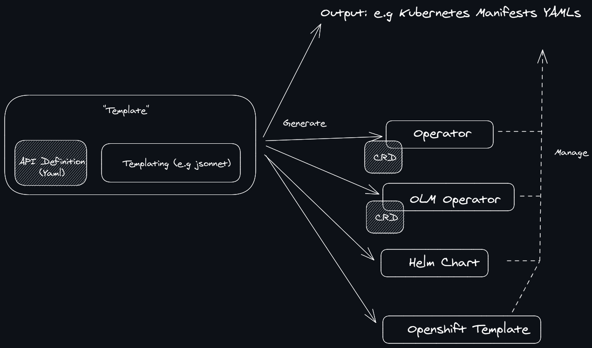

# rndr

**rndr** (*render*): Simplify your cloud native system adoption with `rndr` templates! 

> Work in heavy progress (exeprimental phase): API and implementation might change.

`rndr` provides a pluggable generator for creating, using and sharing reusable templates that can be expanded into deployment manifests for systems like Kubernetes and beyond, generated into operator or helm!
`rndr` can be more or less compared to `helm` - but on steroids (see [the comparison below](#comparisons)).

TODO(bwplotka): If prototype is generally approved, move this to separate org (kind of created https://github.com/staterndr)



## Features

* Abstract away classic boilerplate or show example deployment model of your system in an easy, reproducible way you can use on production.
* Use templating engine of your choice without exposing this detail to the user! Anything that "runs" as definitive OS process is supported
  
> Trust us: **Most likely user don't want to see raw jsonnet** (:

* Maintain stable and easy to use template `values` in either `go` or `proto` allowing easy validation of template values on render time.
* Tight integration with charts. Generate `helm` charts from your system's `rndr` template or use chart as `rndr` template itself.
* You can't escape from `#operator` movement. `rndr` allows to render your deployment state for both GitOps use and operator use. With simple `operator` option instead of raw resources `rndr` will generate you a ready to use operator allowing to reconcile state in runtime.
* Currently supports Kubernetes only, but can be extended for other orchestator systems using declarative configuration.

## Non-Goals

* Deploying is explicitly a domain of other tools like `kube apply`, `locutus`, `helm` and others.

## Usage

### Creating template for your system deployment 

Let's define some example template that allows easy deploy of example `helloservice`. 

1. Create a template in the templating language you love! It can be `helm chart`, `jsonnet`, `cue`, `Go templates` or even [`golang`](github.com/bwplotka/mimic) or `python`! Anything that will take template input in `YAML` and produce resources in YAML files that declare the desired state of the system. 

2. Define API for values (values definition) in `go` or `proto`. Make sure your templating engine consumes YAML and JSON marshalled by such definition.

> NOTE: See example [here](examples/hellosvc/api). There are tons of good practices for maintaining stable and easy to consume API definition (backward compatibility, 'extra' fields etc). Refer to https://github.com/openproto/protoconfig for details.
   
3. Tell `rndr` where values definition are (`api` field) and where and how to use your templating language (`renderer`).

For example, you could have `hellosvc.tmpl.yaml` (as you can see how it's used defined in our [example directory](examples/hellosvc/hellosvc-tmpl-jsonnet))

```yaml
version: v1
name: "helloservice"
authors: "team@example.com"

template:
  # api defines the definition of values.
  api:
    go:
      default: "github.com/observatorium/rndr/examples/hellosvc/api.Default()"
      struct: "github.com/observatorium/rndr/examples/hellosvc/api.HelloService"
  #  or
  #  proto:
  #    entry: "Config"
  #    message: "openproto/protoconfig.proto"
  #  
  
  # renderer defines the rendering engine.
  renderer:
    jsonnet:
      # functions represent a local or absolute paths to .jsonnet files with
      # single `function(values) {` that renders manifests in right order.
      # Each function's manifests will be part of different groups allowing parallel rollout if requested.
      functions: [hellosvc.libsonnet]
  #  or
  #  helm:
  #    chart: prometheus
  #    repo: 
  #  or
  #  process:
  #    command: "./my-cmd"
  #    inputEnvVar: "INPUT"
  #    arguments:
  #    - "--config=${INPUT}

packages:
  <name1>:
    outputDir: ./olm
    olm:
      #...
  <name2>:
    outputDir: ./operator
    kubeOperator:
      #...
  <name3>:
    outputDir: ./helm
    helm:
      #...
  <name4>:
    outputDir: ./oc
    openshiftTemplates:
      #...
```

### Using your template to render desired deployment state 

With the template and value definitions we can use `rndr` to render Kubernetes resources with values we want that are ready to be deployed by your own GitOps pipeline or just using `kube apply`!

```bash
rndr -t="hellosvc.tmpl.yaml" kubernetes manifests --values="my-special-hellosvc.values.yaml" -o "./here" 
```

Run and see examples:

* [`make -C examples/hellosvc kubernetes`](examples/hellosvc/Makefile)
* [`make -C exmaples/hellosvc kubernetes-special`](examples/hellosvc/Makefile)

### Using rndr to generate operator!

This command will generate Kubernetes resources that use `locutus` project for reconciling your resources from inside the cluster.

```bash
rndr -t="hellosvc.tmpl.yaml" kubernetes operator -o "./here" 
```

### Using rndr to generate helm chart from your template (!)

There is always the same question for all of the project maintainers. Everyone wants to use helm charts, no one want
to maintain them. What if you can use your favorite templating tool to generate ... helm chart?

It's as easy as single command:

```bash
rndr -t="hellosvc.tmpl.yaml" kubernetes helm -o "./here" 
```

Make it easy to support helm chart users even if you don't use helm yourself!

### Using rndr to generate... jsonnet?

So maybe your company loves jsonnet, but you don't. We hear you!
With `rndr` you can use your own language and generate `jsonnet` package. It's as simple as:

```bash
rndr -t="hellosvc.tmpl.yaml" --values="my-special-hellosvc.yaml" kubernetes jsonnet -o "./here" 
```

## Comparisons

* `helm`:
  
  * `helm` tries to solve both templating and deployment. `rndr` believes in `do one thing and do it well` UNIX philosophy and focuses on templating part only.
  * `rndr` allows to render resources or operator that will operate those resources (thanks to [`locutus`](https://github.com/brancz/locutus) project) 
  * `rndr` aims to have stable, backward and forward compatible API for your templates (using protobuf). That's hard with helm charts.
  * `rndr` allows to use more advanced templating then just Go Templating.
  
* Helm charts as operator: https://docs.openshift.com/container-platform/4.2/operators/operator_sdk/osdk-helm.html

## Credits

* @brancz & [`locutus`](https://github.com/brancz/locutus)
* BanzaiCloud for declarative installer inspiration https://banzaicloud.com/blog/declarative-installer/

